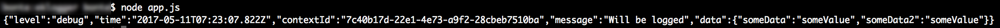
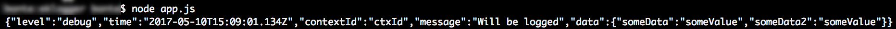
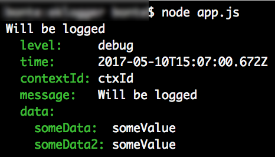

# Eklogger

A Lightweight logger that combines namespacing, levels and multi output.

## Installation

### Installing packages

``` bash
  $ npm install
```

## Usage
The logger must be initialized with one or many `namespace` and a `level.`

For use it, just instantiating a logger with a namespace and call a log function.

There are 5 level. Each `level` has a specific integer priority. The logger can't output if the log level isn't bigger than logger level ( setLevel() ).

``` js
{ trace: 0, debug: 1, info: 2, warn: 3, error: 4 }
```

Example app.js

``` js
    const logger = require('./index');
    
    logger.setNamespaces('namespace:*');
    logger.setLevel('debug');
    
    const log = logger('namespace:subNamespace');
    log.debug('Will be logged', {someData: 'someValue', someData2: 'someValue'});
```
output : 


## Recommended Usage

The logger can have a specifier context id.

Example app.js

``` js
    const logger = require('./index');
    
    logger.setNamespaces('namespace:*');
    logger.setLevel('debug');
    
    const log = logger('namespace:subNamespace');
    log.debug('ctxId', 'Will be logged', {someData: 'someValue', someData2: 'someValue'});
```
output : 



## Logging Namespace

The logger can have many namespace. If the log namespace isn't in logger namespace list, the logger can't output. For enable or disable a namespace, use setNamespace function.

### Enabling and Disabling Logging Namespaces

``` js
  logger.setNamespaces('namespace:*, -namespace:wrongSubNamespace');
  logger.setLevel('debug');
  
  const log = logger('namespace:subNamespace');
  const log2 = logger('namespace:wrongSubNamespace');
  log.debug("Will be logged");
  log2.info("Will not be logged");
```

``` js
    logger.setNamespaces('*, -wrongNamespace');
    logger.setLevel('debug');
    
    const log = logger('namespace:subNamespace');
    const log2 = logger('wrongNamespace');
    log.debug("Will be logged");
    log2.info("Will not be logged");
```

### Using Logging Namespaces

``` js
  logger.setNamespaces('namespace:*');
  logger.setLevel('debug');
  
  const log = logger('namespace:subNamespace');
  const log2 = logger('wrongNamespace:subNamespace');
  log.debug("Will be logged");
  log2.info("Will not be logged");
```

``` js
  logger.setNamespaces('namespace:subNamespace');
  logger.setLevel('debug');
  
  const log = logger('namespace:subNamespace');
  const log2 = logger('namespace:wrongSubNamespace');
  log.debug("Will be logged");
  log2.info("Will not be logged");
```

## Logging Output

The logger have two output type. Available values are "pretty" or "json". Default is json

### JSON

``` js
  const logger = require('./index');
      
  logger.setNamespaces('namespace:*');
  logger.setLevel('debug');
  //logger.setOutput('json');
      
  const log = logger('namespace:subNamespace');
  log.debug('ctxId', 'Will be logged',{someData: 'someValue', someData2: 'someValue'});
```
output : 


### Pretty

``` js
  const logger = require('./index'&);
      
   logger.setNamespaces('namespace:*');
   logger.setLevel('debug');
   logger.setOutput('pretty');
   
   const log = logger('namespace:subNamespace');
   log.debug('ctxId', 'Will be logged',{someData: 'someValue', someData2: 'someValue'});
```
output : 



## Data

A logger should write a Json Object with expected data.

``` js
    logger.setNamespaces('namespace:*');
    logger.setLevel('info');
    
    const log = logger('namespace:subNamespace');
    
    log.warn('message', { someData: 'someValue' });
```

## contextId

``` js
    logger.setNamespaces('namespace:*');
    logger.setLevel('info');
    
    const log = logger('namespace:subNamespace');
    
    log.warn('ctxId', 'message');
    log.error('ctxId', 'message', { someData: 'someValue' });
```

# Tests

## Run Tests

``` bash
  $ make test
```